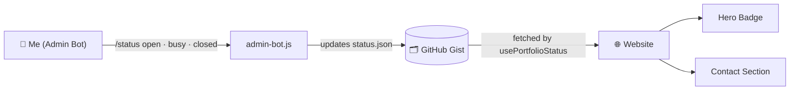
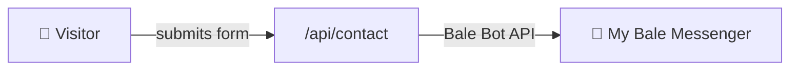

<div align="center">

# 🚀 Mohammad Moein Kashfi Nejad

### Full-Stack Developer Portfolio

*A highly interactive portfolio with real-time backend integrations and a custom-built remote control for my availability status.*

<br />


</div>

---

## 📑 Table of Contents

- [About](#-about)
- [Key Features](#-key-features)
- [How the Remote Control Works](#-how-the-remote-control-works)
- [Tech Stack](#-tech-stack)
- [Getting Started](#-getting-started)
- [Project Structure](#-project-structure)
- [Contact](#-contact)
- [License](#-license)

---

## 👋 About

Welcome to the repository for my personal portfolio website. This project showcases my skills in modern web development, featuring a highly interactive UI, real-time backend integrations, and a custom-built remote control system for my availability status.

---

## 🌟 Key Features

| Feature | Description |
| :-- | :-- |
| 🌐 **Bilingual Support (EN/FA)** | Full internationalization (i18n) with seamless RTL (Right-to-Left) layout switching for Persian. |
| 🌓 **Adaptive Dark/Light Mode** | Custom neon-themed UI that dynamically adjusts to system preferences or user choice. |
| 🎨 **3D Interactive Hero** | A stunning 3D background built with React Three Fiber / Three.js. |
| 🤖 **Custom Bale/Telegram Bot** | The contact form doesn't use email; it sends messages directly to my personal Bale messenger via a custom bot API. |
| 🎛️ **Real-Time "Remote Control" Status** | A hidden admin bot lets me switch my availability (🟢 Open, 🟡 Busy, 🔴 Closed) from my phone. The site instantly updates the Hero badge and Contact section using a serverless GitHub Gist database. |
| ✨ **Micro-interactions** | Smooth page transitions, custom glowing scrollbars, and Framer Motion animations throughout. |
| 📱 **Fully Responsive** | Optimized for mobile, tablet, and desktop screens. |

---

## 🎛️ How the Remote Control Works



And in the other direction, the contact form:



---

## 🛠️ Tech Stack

| Category | Technology |
| :-- | :-- |
| **Framework** | [Next.js 14+ (App Router)](https://nextjs.org/) |
| **Language** | [TypeScript](https://www.typescriptlang.org/) |
| **Styling** | [Tailwind CSS](https://tailwindcss.com/) + Custom CSS Variables |
| **Animations** | [Framer Motion](https://www.framer.com/motion/) & [Three.js](https://threejs.org/) |
| **Forms** | [React Hook Form](https://react-hook-form.com/) + [Zod](https://zod.dev/) validation |
| **Database / State** | [GitHub Gist API](https://docs.github.com/en/rest/gists) (lightweight, free JSON store) |
| **Messaging** | [Bale / Telegram Bot API](https://core.telegram.org/bots/api) |

---

## 🚀 Getting Started

Follow these steps to run the project locally.

### 1. Prerequisites

- **Node.js** v18 or higher
- **npm**, **yarn**, or **pnpm**

### 2. Installation

Clone the repository and install dependencies:

```bash
git clone https://github.com/DrGhost019/portfolio.git
cd portfolio
npm install
```

### 3. Environment Variables

This project requires a `.env.local` file in the root directory to handle the Bot and Status integrations. Create the file and add the following variables:

```env
# Bale/Telegram Bot Configuration
BALE_BOT_TOKEN=your_bot_token_here
BALE_CHAT_ID=your_chat_id_here

# GitHub Gist Configuration (For Real-Time Status)
GITHUB_TOKEN=your_github_personal_access_token
GIST_ID=your_gist_id
GIST_FILENAME=status.json
GIST_RAW_URL=https://gist.githubusercontent.com/.../raw/status.json

# Admin Security
ADMIN_SECRET=your_super_secret_password
```

> ⚠️ **Never commit `.env.local`.** It is ignored by Git and contains secrets.

### 4. Running the Development Server

```bash
npm run dev
```

Then open [http://localhost:3000](http://localhost:3000) in your browser.

> 💡 **Testing the Admin Bot locally:** run the bot script in a separate terminal window:
>
> ```bash
> node admin-bot.js
> ```

---

## 📂 Project Structure

```text
├── public/             # Static assets (images, fonts, icons)
├── src/
│   ├── app/            # Next.js App Router (Pages & API Routes)
│   │   ├── [locale]/   # Dynamic routing for EN/FA languages
│   │   └── api/        # Backend API routes (Contact & Admin Status)
│   ├── components/     # Reusable UI components and Sections
│   ├── hooks/          # Custom React hooks (e.g., usePortfolioStatus)
│   ├── lib/            # Utilities, i18n dictionaries, and configs
│   └── styles/         # Global CSS and Tailwind configurations
├── admin-bot.js        # Node.js script for the Bale Bot remote control
├── .env.local          # Local environment variables (Ignored by Git)
└── next.config.ts      # Next.js configuration
```

---

## 📬 Contact

If you have any questions or just want to say hi, feel free to reach out:

- 📧 **Email:** [moienkashefi.19@gmail.com](mailto:moienkashefi.19@gmail.com)
- 💼 **LinkedIn:** [Mohammad Moein Kashfi Nejad](https://www.linkedin.com/in/mohammad-moien-kashefi-nejad-280b742a0/)
- 💬 **Telegram/Bale:** [@DrGhost019](https://t.me/DrGhost019)

---

## 📄 License

This project is open source and available under the **MIT License**. Feel free to use the code as inspiration for your own portfolio, but please provide attribution!

---

<div align="center">

Built with ❤️ and ☕ by **Mohammad Moein Kashfi Nejad**

</div>
